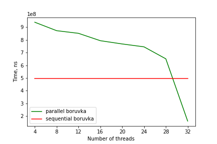

# Parallel Boruvka's algorithm

## Introduction

This is a parallel version of the Boruvka's algorithm. It uses a wait-free DSU and an edge list representation of the graph. I achieved time complexity of `O(E log^2 V / P)` where `E` is the number of edges, `V` is the number of vertices and `P` is the number of processors.

I've seen a lot of articles describing the algorithm, yet none of them actually went into detail about what the implementation should look like. I've also found two repositories with the same algorithm:
* [https://github.com/NatashaL/boruvka](https://github.com/NatashaL/boruvka)
* [http://kfuh1.github.io/15418-project/](http://kfuh1.github.io/15418-project/)

Huge props to them for giving me a better understanding of the problem. However, they either were not parallelized properly and would work slowly for certain graphs, or only a part of the algorithm was parallel.

## My solution

We store the graph as an edge list (`edges`) where each edge `(u, v)` appears twice: as an edge from `u` and from `v`. At each step of the algorithm, `edges` is sorted in `O(E log E) = O(E log V)` time.

Then edges are split between `P` processors. Each one of them calculates the array of shortest edges from its local nodes. Because allocating raw memory for all nodes is done in constant time, we can simply store this as an array and avoid using hashmaps. Then we merge the results between processors into a global shortest edge array using compare and swap. Note that because we sorted the edge list previously, all edges from `u` make up a continuous segment in `edges`. Because of this, the total number of extra iterations in the cas loop does not exceed `O(P)` which gives us `O(E / P + P) = O(E / P)` time for this step. 

After that, we can merge components along the added edges in `O(V * alpha(V) / P)` time using a parallel DSU algorithm. 

The next step is updating the list of vertices and edges, this can be done using parallel cumulative sum in `O(V / P)` and `O(E / P)` respectively.

Since the total number of iterations is `O(log V)`, the overall time complexity is `O(E log^2 V / P)`.

## Performance

I tested the performance of this algorithm on [roadNet-CA](https://snap.stanford.edu/data/roadNet-CA.html), a California road network dataset from SNAP. It has `1,965,206` nodes and `2,766,607` edges, the weights were assigned randomly. The server had 32 dedicated Intel Xeon Skylake (2.7 GHz, 3.7 GHz turbo) vCPUs. The compilation flags were `g++ -fopenmp -std=c++17 -mtune=native -mavx2 -O2`.

As you can see, it works slower than the sequential version most of the time, but outperforms it by a factor of three on 32 threads. This is probably due to a large overhead we gain from the parallelization. The most important thing is that you could achieve even better runtime with more threads.

